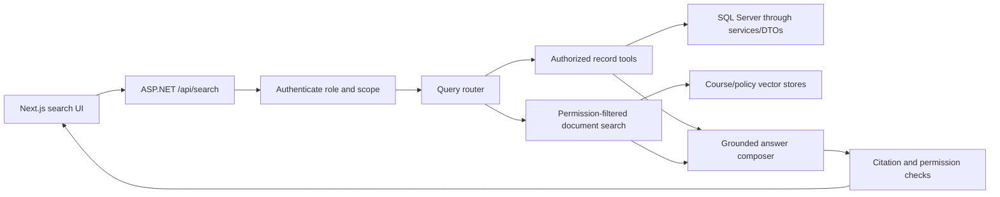

# CampusFlow Feature Inventory and AI Roadmap

Last audited: 2026-08-26  
Last progress update: 2026-08-26

> **Living document:** Update this file in the same change whenever a feature is implemented, its scope changes, a blocker is discovered, a technical decision is made, or verification is completed. Future agents should read this file before proposing or changing features.

## Current implementation handoff

| Item | Current state |
|---|---|
| Current product phase | **P0 — stabilize and secure the current application** |
| Active implementation | **P0-04 and P0-05 are implemented and unit-tested.** Passwords use PBKDF2 with transparent legacy-hash upgrade on login; account emails are normalized (trim + lowercase), enforced unique by indexes on both tables, and duplicate registration returns a safe `409 Conflict` that the registration form displays. |
| Next recommended task | Begin P0-07 in bounded chunks: rate-limit login/register endpoints and review the cookie `SameSite=None` CSRF posture. |
| Latest product decision | Assignments belong to course sections, not individual students. One email address may exist once as a Student and once as a Teacher (separate role tables; per-table unique indexes). |
| Latest verified code change | P0-05: email normalization in both register/login paths, `DuplicateEmailException` mapped to 409 ProblemDetails, migration `20260826101123_NormalizeAndUniqueEmails` applied (normalizes existing rows, adds unique indexes). Frontend `apiClient` now prefers the ProblemDetails `detail` field for safe messages. |
| Verification baseline | Backend Release build: 0 errors / 37 nullable warnings. Backend xUnit suite: **23/23 passing** via `dotnet test`. All six migrations report applied; EF reports no pending model changes. Frontend `npx tsc --noEmit` passes. |
| Known immediate blocker | Login and registration endpoints are unthrottled and the JWT cookie uses `SameSite=None` without antiforgery tokens (P0-07). Uploaded files remain publicly downloadable via static files (P0-08). A JWT signing key remains committed in `appsettings.json` and must be rotated before any deployment. |

## 1. Purpose

This document is the product and engineering source of truth for CampusFlow. It records:

- features that are implemented now;
- features that are only partially implemented or currently blocked;
- security and reliability work required before production;
- product features recommended for students, teachers, and administrators;
- the proposed AI search feature and its technical design;
- a prioritized implementation roadmap and definition of done.

## 2. Audit scope and status meanings

The audit covered:

- the Next.js frontend in this repository;
- the ASP.NET Core backend at `C:\Porjects\CampusFlow\CampusFlow`;
- frontend service contracts versus backend controller routes and DTOs;
- the EF Core data model and migrations;
- authentication, authorization, uploads, and error handling.

The frontend passes `npx tsc --noEmit`. This was a code and contract audit, not a complete browser-to-database acceptance test. A feature marked **Code-aligned** has matching frontend and backend code paths, but it must still receive an automated integration test before production.

| Status | Meaning |
|---|---|
| **Code-aligned** | Frontend and backend contracts match and the feature is implemented in code. |
| **Partial** | Some UI or backend capability exists, but the end-to-end workflow is incomplete. |
| **Backend only** | An API exists, but no usable frontend workflow exists. |
| **Demo only** | The UI works with mock data rather than real persisted data. |
| **Blocked** | A known contract, database, or security problem prevents reliable use. |
| **Planned** | The feature does not exist yet and is recommended below. |

## 3. Executive summary

CampusFlow already has a useful foundation: student registration, student and teacher login, role-protected APIs, student GPA/schedule views, teacher management forms, assignment/submission backend models, file storage, and responsive dashboards.

The application is not production-ready yet. The highest-risk gaps are database migration drift, assignment API mismatches, direct serialization of database entities, weak password hashing, missing global exception handling, missing unique email constraints, incomplete route protection, and the absence of automated tests.

The best first AI feature is **CampusFlow AI Search & Academic Assistant**. It should let users ask natural-language questions across two strictly separated sources:

1. authorized live records, such as the signed-in student's schedule and assignments;
2. course documents, such as assignment briefs, lecture notes, policies, and announcements.

The assistant must return cited, permission-filtered answers. It must not generate arbitrary SQL, change grades, submit assignments, or expose another user's data.

## 4. Current feature inventory

### 4.1 Authentication and account features

| Feature | Frontend | Backend | Overall status | Notes |
|---|---:|---:|---|---|
| Student registration | Yes | Yes | **Code-aligned** | Client validates name, age, email, phone, password, and password confirmation. Backend exposes `POST /api/student/register`. |
| Student login | Yes | Yes | **Code-aligned** | Uses `POST /api/student/login`; identity is returned to the client and JWT is stored in an HTTP-only cookie. |
| Teacher login | Yes | Yes | **Code-aligned** | Role selector uses `POST /api/teacher/login`. |
| Logout | Yes | Yes | **Code-aligned** | `POST /api/auth/logout` clears the JWT cookie; frontend clears `sessionStorage`. |
| Role authorization | Partial | Yes | **Partial** | Backend uses `[Authorize(Roles = ...)]`. Frontend uses `sessionStorage` redirects, which are UX guards rather than a secure authorization boundary. |
| Current-student identity | No | Yes | **Backend only** | `GET /api/student/me` exists but is not used to restore or verify the frontend session. |
| Teacher registration | No | Yes | **Backend only** | `POST /api/teacher/register` exists. There is no teacher registration or admin invitation screen. |
| Password recovery/change | No | No | **Planned** | No forgot-password, reset-token, change-password, or email-verification workflow exists. |
| Account lockout/rate limits | No | No | **Planned** | Login and registration endpoints are not rate-limited. |

### 4.2 Student features

| Feature | Frontend | Backend | Overall status | Notes |
|---|---:|---:|---|---|
| Student dashboard | Yes | Yes | **Partial** | Loads GPA, schedules, and assignments together. One failed request currently prevents all three sections from loading. |
| Semester GPA chart | Yes | Yes | **Code-aligned** | Uses `GET /api/student/my-gpa`. The chart is labelled “CGPA Trend” but currently plots individual semester GPA, not calculated cumulative GPA. |
| Schedule timeline | Yes | Yes | **Partial** | Uses `GET /api/student/my-schedules`. Records have times but no date/day/recurrence, so “Today's Schedule” cannot be determined correctly. |
| Assignment summary | Yes | Yes | **Blocked** | Frontend/backend code is aligned to enrolled course sections, but the active database must contain the required assignment, section, enrollment, and submission schema before runtime verification. |
| Assignment submission status | Yes | Yes | **Code-aligned** | The frontend maps `submitted`, `submissionFilePath`, and `submittedAt` and updates the card immediately after a successful upload. |
| Course information on assignments | Yes | Yes | **Code-aligned** | Cards display the backend-provided course code, course title, and section name. |
| Download assignment brief | Yes | Yes | **Partial** | The UI opens `filePath`. Files are still served as direct static URLs; downloads need an authorization-checked endpoint or short-lived signed URL. |
| Submit assignment file | Yes | Yes | **Code-aligned** | Student cards validate the 25 MB client limit and send multipart data to `POST /api/student/assignments/{assignmentId}/submit`. |
| Full grade card | Yes | No | **Demo only** | The `/Grades` page uses mock transcript data because `GET /api/student/grade-card` does not exist. |
| Grade-card printing | Yes | N/A | **Code-aligned** | Browser print view and semester filtering are implemented for the demo transcript. |
| Responsive student navigation | Yes | N/A | **Code-aligned** | Desktop sidebar and mobile drawer are implemented. |
| Attendance | Link only | No | **Planned** | `/attendance` is linked but the route and data model do not exist. |
| Courses | Link only | Inactive models | **Planned** | `/courses` is linked. `Course` and `CourseEnrollment` classes exist, but they are not active `DbSet`s in the current context. |
| Assignments page | Link only | Partial | **Planned** | `/assignments` is linked but no route exists. |
| Timetable page | Link only | Partial | **Planned** | `/timetable` is linked but no route exists. |
| Notifications | Link only | No | **Planned** | `/notifications` is linked but no route or backend feature exists. |
| Settings/profile | Link only | No | **Planned** | `/settings` is linked but no route or update endpoint exists. |

### 4.3 Teacher features

| Feature | Frontend | Backend | Overall status | Notes |
|---|---:|---:|---|---|
| Teacher dashboard tabs | Yes | N/A | **Code-aligned** | Student list, Add GPA, Add Schedule, and Add Assignment tabs exist. |
| View all students | Yes | Yes | **Blocked** | The controller returns EF entities directly. This risks serializing password hashes and navigation cycles. Replace with a safe projected output DTO before use. |
| Add semester GPA | Yes | Yes | **Code-aligned** | Frontend and `POST /api/teacher/add-gpa` match. Business validation and duplicate-semester rules are still needed. |
| Add schedule entry | Yes | Yes | **Code-aligned** | Frontend and `POST /api/teacher/add-schedule` match. Day/date and overlap validation are missing. |
| Create assignment | Yes | Yes | **Blocked** | The code contract is aligned at multipart `POST /api/teacher/assignments`, and the UI targets one teacher-owned course section. Runtime use remains blocked until the active database schema is aligned. |
| Attach assignment brief | Yes | Yes | **Code-aligned** | The teacher form accepts the backend allowlist, validates the 25 MB client limit, and lets the browser generate the multipart boundary. |
| View assignment submissions | Partial | Yes | **Partial** | After publishing, the teacher can refresh and open submissions for that assignment. The backend still needs a teacher-assignment list endpoint so existing assignments remain discoverable after refresh/login. |
| Grade/return a submission | No | No | **Planned** | No marks, feedback, rubric, returned status, or resubmission workflow exists. |
| Teacher-specific sidebar links | Yes | N/A | **Partial** | Links point to routes such as `/teacher/students` and `/teacher/add-gpa`, but those separate routes do not exist; the working UI is tab-based on `/teacherDashboard`. |

### 4.4 Platform and backend features

| Feature | Status | Notes |
|---|---|---|
| Shared typed API client | **Code-aligned** | Adds credentials and JSON headers and parses successful responses. |
| Safe frontend error messages | **Code-aligned** | Rejects stack traces, SQL details, paths, connection IDs, and oversized/multiline technical responses. |
| Global backend exception handling | **Code-aligned** | Centralized `IExceptionHandler` maps safe RFC `ProblemDetails`, logs full exceptions server-side, returns a trace ID, and wraps the controller pipeline. Raw exception messages are not returned. |
| JWT cookie authentication | **Implemented** | Seven-day JWT cookie, HTTP-only, secure, and role claims are implemented. CSRF/session strategy needs a production review. |
| CORS | **Implemented for local development** | Only `localhost:3000` origins are allowed. Production origins must come from configuration. |
| Swagger/OpenAPI | **Implemented in development** | Useful for API testing and contract generation. |
| SQL Server + EF Core migrations | **Partial/blocked** | Migrations exist, but startup does not apply or verify them, and the active database has demonstrated schema drift. |
| File storage | **Implemented locally** | Randomized filenames, extension allowlist, and a 25 MB limit exist. Production needs malware scanning and external object storage. |
| Automated tests | **Missing** | No frontend unit, backend unit, API integration, contract, or end-to-end suite exists. |
| CI/CD | **Missing** | No automated lint, typecheck, test, migration, build, or deployment pipeline is defined. |
| Observability | **Missing** | No structured logging, tracing, metrics, alerting, or audit-log pipeline exists. |

## 5. Existing backend API inventory

| Method | Endpoint | Role | Current frontend usage |
|---|---|---|---|
| `POST` | `/api/student/register` | Public | Used |
| `POST` | `/api/student/login` | Public | Used |
| `GET` | `/api/student/me` | Student | Not used |
| `GET` | `/api/student/my-gpa` | Student | Used |
| `GET` | `/api/student/my-schedules` | Student | Used |
| `GET` | `/api/student/my-assignments` | Student | Used and mapped to section/submission fields; runtime database verification pending |
| `POST` | `/api/student/assignments/{assignmentId}/submit` | Student | Used |
| `POST` | `/api/teacher/register` | Public | Not used |
| `POST` | `/api/teacher/login` | Public | Used |
| `GET` | `/api/teacher/students` | Teacher | Used, but unsafe entity serialization must be fixed |
| `POST` | `/api/teacher/add-gpa` | Teacher | Used |
| `POST` | `/api/teacher/add-schedule` | Teacher | Used |
| `GET` | `/api/teacher/sections` | Teacher | Used to populate the assignment target selector |
| `POST` | `/api/teacher/assignments` | Teacher | Used with multipart form data |
| `GET` | `/api/teacher/assignments/{assignmentId}/submissions` | Teacher | Used for the newly published assignment; existing assignment discovery is missing |
| `POST` | `/api/auth/logout` | Public | Used |

There is no backend endpoint for the current grade-card UI.

## 6. Priority 0: stabilize and secure the current application

These tasks should be completed before expanding the product or integrating AI.

| ID | Required work | Details and acceptance criteria |
|---|---|---|
| P0-01 | Fix database migration drift | Back up the database, apply pending migrations, verify `__EFMigrationsHistory`, and add a deployment migration step. The API must fail health checks when its schema is behind. |
| P0-02 | Align assignment contracts | **Code-aligned:** section-wide ownership, teacher section selector, one multipart creation route, typed student status fields, brief links, and multipart student submission are implemented. **Remaining before verified completion:** align the active database, protect file downloads, and add role/section integration and browser E2E tests. |
| P0-03 | Stop returning EF entities | Create `StudentSummaryDto`, `GpaDto`, `ScheduleDto`, and other response DTOs. Explicitly project allowed fields. Password hashes and navigation properties must never leave the backend. |
| P0-04 | Replace SHA-256 password hashing | **Verified complete (2026-08-26):** `PasswordService` wraps ASP.NET Core Identity `PasswordHasher<object>` (PBKDF2, per-user salt). Registration hashes with PBKDF2; login detects legacy 64-hex unsalted SHA-256 hashes via constant-time comparison and transparently rehashes to PBKDF2 on the first successful login (students through `IStudentRepository.UpdatePasswordHash`, teachers through the tracked entity). Malformed stored hashes fail authentication safely. `PasswordHelper` deleted. Covered by 17 xUnit tests in `CampusFlow.Tests`. Remaining follow-up: live-database runtime verification of an upgrade for a real legacy account, and integration tests at the API layer. |
| P0-05 | Enforce account uniqueness | **Verified complete (2026-08-26):** emails normalized (trim + lowercase) at both registers and logins via `Helpers.Emails.Normalize`; pre-insert duplicate checks plus `DbUpdateException` translation throw `DuplicateEmailException`, which the global handler maps to `409 Conflict` with a fixed safe message. Migration normalizes existing rows then adds unique indexes `IX_Students_Email` / `IX_Teachers_Email`. Product decision: one email may exist in both role tables. Covered by 6 new unit tests (23 total). Remaining follow-up: API-layer integration tests; live check that no legacy case-variant accounts were silently merged (normalization makes them collide only if identical after lowering). |
| P0-06 | Add global safe errors | Use centralized ASP.NET Core exception handling and RFC `ProblemDetails`. Never return stack traces, SQL errors, secrets, cookies, or local paths to clients. |
| P0-07 | Harden authentication | Add login rate limits, account lockout/backoff, CSRF protection appropriate to cookie auth, configurable cookie settings, session expiry handling, and server-verified route guards. |
| P0-08 | Harden uploads | Validate MIME and file signatures, scan malware, restrict download authorization, generate safe content-disposition headers, and move production files to object storage. |
| P0-09 | Add validation/business rules | Validate GPA range and duplicate semester, schedule ordering/overlap, assignment due dates, file requirements, and inactive users on the backend. |
| P0-10 | Remove stale client services | **Verified complete (2026-08-26):** deleted `services/loginstudentservice.ts` (dead `/student/loginStudent` target), `services/registerstudentservice.ts` (dead `/student/registerStudent` target), and `app/utils/auth.ts` (logout that never cleared the backend cookie). Zero imports existed; `services/authService.ts` is now the single typed auth contract. `npx tsc --noEmit` and `npm run build` passed after deletion. |
| P0-11 | Add automated quality gates | CI must run frontend lint/typecheck/build, backend build/tests, migration checks, API contract tests, and a small browser end-to-end suite. |
| P0-12 | Add operational basics | Environment-specific configuration, health endpoints, structured logs with correlation IDs, audit logs for grade changes, backups, and restore testing. |

## 7. Recommended product features

### 7.1 Student experience

| Priority | Feature | Details |
|---|---|---|
| P1 | Complete dashboard summary | Independent loading/retry per widget; current GPA, cumulative GPA, attendance percentage, next class, assignments due, and recent announcements. |
| P1 | Courses and enrollment | Show current/past courses, section, teacher, credits, syllabus, materials, announcements, and classmates only where policy allows. |
| P1 | Real grade card | Course-level assessments and marks, semester GPA, CGPA, earned credits, transcript PDF export, and clear provisional/final states. |
| P1 | Assignment workspace | List/filter assignments, view brief, download attachments, upload/replace submissions before deadline, see late/submitted/graded states, feedback, rubric, and marks. |
| P1 | Timetable/calendar | Day/date/term-aware recurring schedule, holidays/cancellations, room or meeting link, agenda/week views, and calendar export. |
| P1 | Attendance | Overall and per-course attendance, session history, absence reasons, correction requests, and low-attendance warnings. |
| P1 | Notifications center | Assignment, grade, attendance, schedule-change, announcement, and submission-feedback notifications with read/unread state. |
| P1 | Profile and account settings | Contact details, avatar, password change, notification preferences, sessions/devices, and accessibility preferences. |
| P2 | Academic planner | Degree progress, prerequisites, completed/remaining credits, planned courses, and graduation progress. |
| P2 | Help and support | FAQ, support tickets, policy documents, and escalation to a human office/teacher. |

### 7.2 Teacher experience

| Priority | Feature | Details |
|---|---|---|
| P1 | Course/section dashboard | Teacher sees only assigned courses, sections, rosters, timetable, materials, announcements, assignments, and performance summary. |
| P1 | Gradebook | Assessments, weighted categories, marks, comments, draft/published states, bulk entry/import, validation, and an audit trail. Calculate GPA from course grades instead of manually entering GPA as the primary workflow. |
| P1 | Assignment management | Draft, publish, schedule, edit, archive, attach files, target a section, set due/late rules, and duplicate an assignment. |
| P1 | Submission review | Filter submission states, preview/download files, rubric grading, private feedback, return for resubmission, and export. |
| P1 | Attendance capture | Create class sessions, mark attendance, bulk edit, document changes, and notify students. |
| P1 | Course materials | Upload/version documents, tag by topic/week, control visibility, and make selected materials searchable by AI. |
| P1 | Announcements | Course/section announcements with scheduled publication and notifications. |
| P2 | Teacher analytics | Distribution, missing work, attendance risk, topic performance, and trend views with drill-down and privacy controls. |

### 7.3 Administrator experience

| Priority | Feature | Details |
|---|---|---|
| P1 | Admin role and portal | Securely invite/manage users, activate/deactivate accounts, reset access, assign roles, and never expose password data. |
| P1 | Academic structure | Departments, programs, terms, courses, sections, rooms, teachers, and academic calendars. |
| P1 | Enrollment management | Add/drop students, imports, enrollment status/history, and section capacity. |
| P1 | Teacher assignment | Assign teachers to course sections and prevent access outside assigned sections. |
| P1 | Policy/configuration | Grading scales, attendance thresholds, late rules, file limits, retention, and notification templates. |
| P1 | Audit and reports | Track security events and changes to grades, attendance, enrollments, and roles; export approved reports. |
| P2 | Data import/integration | Controlled CSV imports and optional SIS/LMS integrations with validation and rollback reports. |

### 7.4 Shared platform features

| Priority | Feature | Details |
|---|---|---|
| P1 | Search | Keyword search across authorized courses, assignments, people, and documents; this becomes the fallback and baseline for AI search. |
| P1 | Pagination/filtering/sorting | Required for students, assignments, submissions, notifications, audit logs, and reports. |
| P1 | File/document service | Versioning, private authorization, virus scanning, object storage, signed URLs, and retention rules. |
| P1 | Accessibility | Keyboard navigation, focus states, screen-reader labels, semantic tables/forms, contrast checks, reduced-motion support, and WCAG testing. |
| P1 | Responsive and empty/error states | Complete mobile workflows, skeletons, independent retries, offline-safe messages, and actionable empty states. |
| P1 | Testing and observability | Unit, integration, contract, E2E, performance and security tests; logs, metrics, traces, alerting, and uptime checks. |
| P2 | Localization | Time zone, date, number, language, and right-to-left support if required. |
| P2 | Email/push notifications | User preferences, batching/digests, delivery logs, retries, and unsubscribe controls. |
| P2 | PWA/offline access | Cache read-only timetable, assignments, and selected course documents; never cache sensitive data without protection. |

## 8. Required academic data model

The current model is too small for a full student management system. Add or redesign the following entities before building most P1 features:

| Entity | Purpose |
|---|---|
| `Department` | Owns programs and courses. |
| `Program` | Degree/program information and requirements. |
| `AcademicTerm` | Semester/term dates and status. |
| `Course` | Stable course catalog record, code, title, credits, and prerequisites. |
| `CourseSection` | A course offering in a term with teacher, room, capacity, and schedule. |
| `Enrollment` | Student membership in a section with status/history. |
| `ScheduleMeeting` | Day/date/recurrence, start/end, room, and meeting link. |
| `Assessment` | Exam, quiz, project, assignment, weight, total marks, and publish state. |
| `Grade` | Student score, feedback, status, grader, and audit metadata. |
| `AttendanceSession` | A dated class meeting. |
| `AttendanceRecord` | Per-student attendance status and change history. |
| `Assignment` | Section, instructions, due/late rules, attachments, and publish state. |
| `Submission` | Student attempt, timestamps, files, status, feedback, score, and version. |
| `CourseMaterial` | Searchable teaching document with visibility and version metadata. |
| `Announcement` | Targeted course/section message and publication schedule. |
| `Notification` | Per-user delivery and read state. |
| `AuditEvent` | Security and academic record change history. |

The existing `Course` and `CourseEnrollment` classes should either be redesigned and returned to `AppDbContext` with migrations, or removed to avoid misleading dead models.

## 9. Recommended AI feature: CampusFlow AI Search & Academic Assistant

### 9.1 What to build first

Build a **role-aware, cited academic search assistant** available from a global search box. It should answer questions such as:

Student examples:

- “What assignments are due this week?”
- “When is my next database class?”
- “Find the lecture note that explains normalization.”
- “Which assignments have I not submitted?”
- “Show my GPA trend, using only my records.”
- “What does the late-submission policy say?”

Teacher examples:

- “Find my materials about database normalization.”
- “Which students in my assigned section have not submitted Assignment 3?”
- “Show submissions that still need review.”
- “Find the attendance policy and cite the exact source.”

Admin examples should initially be limited to document/policy search. Cross-user analytics should be implemented only after permissions, audit logs, aggregation rules, and privacy review are mature.

### 9.2 Why this is the best first AI feature

- It solves a frequent navigation problem across assignments, schedules, grades, and documents.
- It builds on data CampusFlow already has or plans to add.
- It can provide evidence links instead of unsupported answers.
- It can start read-only, which reduces risk.
- It creates reusable search infrastructure for future recommendations and analytics.
- It is more useful and safer than adding an open-ended chatbot with unrestricted database access.

### 9.3 Search architecture



OpenAI vector stores support processed files, semantic search, result scores, file attributes, and attribute filters. Those capabilities fit course-material and policy retrieval, but application authorization must still be enforced by CampusFlow before and after retrieval. See the [official OpenAI Vector Stores API reference](https://developers.openai.com/api/reference/resources/vector_stores).

### 9.4 Two retrieval paths

#### A. Structured academic record tools

Use controlled backend functions for live records:

- `GetMyAssignments(userId, dateRange, status)`
- `GetMySchedule(userId, dateRange)`
- `GetMyGrades(userId, term)`
- `GetMyAttendance(userId, courseId)`
- `GetTeacherMissingSubmissions(teacherId, sectionId, assignmentId)`
- `GetTeacherPendingReviews(teacherId, sectionId)`

The server must obtain identity from the validated JWT. Do not accept an arbitrary `studentId` from an AI-generated request. The model must never generate or execute raw SQL.

#### B. Semantic document retrieval

Index only approved content:

- course materials;
- assignment briefs;
- announcements;
- syllabi;
- university policies and FAQs;
- teacher-provided reference documents.

Attach authorization metadata such as institution, course section, term, document type, visibility, and owner. Filter candidates by the signed-in user's authorized sections before composing an answer. Keep private student records out of shared document vector stores.

### 9.5 AI backend endpoints

| Method | Endpoint | Purpose |
|---|---|---|
| `POST` | `/api/search` | Submit a natural-language query; return grounded answer, sources, and structured result cards. |
| `POST` | `/api/search/feedback` | Record helpful/not-helpful feedback and optional reason. |
| `POST` | `/api/teacher/sections/{sectionId}/documents` | Upload and queue an authorized course document for indexing. |
| `GET` | `/api/teacher/sections/{sectionId}/documents` | List document/indexing status. |
| `DELETE` | `/api/teacher/sections/{sectionId}/documents/{documentId}` | Remove authorization and delete the indexed copy. |
| `POST` | `/api/admin/policies/documents` | Upload approved institution-wide policy content. |

Suggested search response shape:

```json
{
  "answer": "You have two assignments due this week.",
  "results": [
    {
      "type": "assignment",
      "id": "assignment-id",
      "title": "Normalization Exercises",
      "url": "/assignments/assignment-id"
    }
  ],
  "sources": [
    {
      "title": "Database Systems Assignment 3",
      "url": "/assignments/assignment-id",
      "snippet": "Due Friday at 11:59 PM"
    }
  ],
  "requestId": "trace-id"
}
```

### 9.6 AI-specific data entities

| Entity | Important fields |
|---|---|
| `SearchDocument` | ID, title, source type/ID, course/section, visibility, owner, file path, checksum, vector-store file ID, indexing status, timestamps. |
| `SearchQueryLog` | Request ID, user/role, query category, authorized scopes, latency, result IDs, model/version, success/failure. Avoid storing unnecessary sensitive prompt text. |
| `SearchFeedback` | Request ID, user, helpful flag, reason category, optional safe comment. |
| `AiUsageDaily` | Date, feature, calls, tokens/cost units, failures, latency percentiles. |

### 9.7 AI security and safety requirements

- Store AI API keys only in backend secrets/environment configuration. Never use a `NEXT_PUBLIC_` variable for an AI key.
- Authenticate every request and calculate permissions on the backend.
- Filter before retrieval and verify every returned source after retrieval.
- Never upload password hashes, JWTs, connection strings, full student tables, or unnecessary personal data to an AI provider.
- Treat retrieved documents as untrusted data; document text must not override system or authorization instructions.
- Require source links for factual answers. If evidence is insufficient, say that no reliable answer was found.
- Keep the first release read-only. Do not let AI modify grades, attendance, enrollments, assignments, or submissions.
- Add per-user rate limits, usage budgets, timeouts, retries, and graceful non-AI fallback search.
- Define data retention/deletion behavior and remove indexed files when access or source documents are removed.
- Log authorization decisions and source IDs without logging secrets or unnecessary personal content.
- Add a visible disclaimer for generated summaries and a route to the authoritative record.

### 9.8 AI rollout phases

| Phase | Scope | Exit criteria |
|---|---|---|
| AI-0: Data readiness | Complete courses, sections, enrollment, document metadata, permissions, and keyword search. | Every searchable item has an owner, visibility rule, canonical URL, and deletion path. |
| AI-1: Document search MVP | Semantic search over approved policies and course materials with snippets and direct links. | Zero unauthorized results in security tests; useful top results on a reviewed test set. |
| AI-2: Cited answers | Generate concise answers strictly from retrieved documents. | Every factual answer has valid sources or explicitly declines to answer. |
| AI-3: Personal academic search | Add read-only tools for the signed-in user's assignments, schedule, grades, and attendance. | Identity always comes from JWT; cross-user leakage tests pass. |
| AI-4: Teacher workflow search | Missing-submission and pending-review queries limited to assigned sections. | Section ownership and audit tests pass; no write actions. |
| AI-5: Recommendations | Optional study/resource recommendations and risk summaries. | Human-reviewed evaluation, fairness/privacy review, explanations, and opt-out are implemented. |

### 9.9 AI evaluation requirements

Create a versioned evaluation set before launch. Measure:

- authorization leakage: target must be zero;
- retrieval relevance for common queries;
- citation validity and source accessibility;
- groundedness/hallucination rate;
- correct refusal when evidence or permission is missing;
- answer usefulness from student/teacher feedback;
- latency, failure rate, and cost per successful query;
- prompt-injection resistance using malicious documents;
- multilingual quality if languages other than English are supported.

Do not evaluate only with demos. Include empty results, expired assignments, inactive users, revoked course access, deleted documents, ambiguous names, and attempts to retrieve another student's information.

## 10. Recommended implementation order

### Phase 1: make the current system trustworthy

- Complete P0-01 through P0-12.
- Fix the assignment database and frontend/backend contract.
- Add safe response DTOs and secure password hashing.
- Add integration tests for registration, login, logout, roles, GPA, schedules, assignments, and uploads.

### Phase 2: establish the academic core

- Add admin, terms, courses, sections, enrollments, and teacher assignments.
- Replace direct GPA entry as the main grading workflow with assessments and gradebook calculations.
- Add dated/recurring timetable and attendance entities.

### Phase 3: complete student and teacher workflows

- Real grade card.
- Assignment details, uploads, submissions, grading, and feedback.
- Course materials, announcements, notifications, profile/settings, and complete routes.

### Phase 4: establish search foundations

- Canonical URLs and permission metadata for every searchable object.
- Keyword search, filters, pagination, document lifecycle, and search audit events.
- Build the AI evaluation dataset and privacy/security tests.

### Phase 5: release AI search incrementally

- AI-1 document search.
- AI-2 cited answers.
- AI-3 personal academic record tools.
- AI-4 teacher workflow search.
- Consider AI-5 recommendations only after real usage data and a privacy/fairness review.

## 11. Definition of done for every feature

A feature is not “done” because a screen exists. It is done only when:

- frontend, API, DTO, database, and authorization contracts are implemented;
- validation exists on both client and server, with the server authoritative;
- loading, empty, success, validation, unauthorized, forbidden, conflict, and server-error states are handled;
- no entity, secret, stack trace, or unauthorized field is exposed;
- unit/integration/contract tests cover normal and failure paths;
- at least one role-based browser end-to-end test passes;
- database migrations and rollback/recovery instructions exist;
- logs, audit events, metrics, and support diagnostics are sufficient;
- accessibility and responsive behavior are checked;
- documentation and API contracts are updated;
- product acceptance criteria are demonstrated with real persisted data, not mock fallback data.

## 12. Product decisions required before implementation

The team should decide and record:

1. Is CampusFlow for one institution or multiple institutions/tenants?
2. Are teachers self-registering, invited by admins, or synchronized from another system?
3. Are assignments targeted to courses/sections, groups, or individual students?
4. What grading scale, weighting rules, GPA rules, repeat-course rules, and publication approvals apply?
5. What attendance statuses, thresholds, correction workflow, and audit requirements apply?
6. What file types, storage region, retention period, and deletion rules apply?
7. Which notifications require email/push versus in-app delivery?
8. What student-data privacy, consent, AI-provider retention, and audit policies apply?
9. Which languages and accessibility standard must be supported?
10. What deployment, backup, recovery-time, and uptime targets apply?

These decisions should be made before finalizing the database and AI authorization model.

## 13. Living-document maintenance protocol

Every feature implementation must update this document before the work is handed off.

### 13.1 Required updates for each feature

1. Update the relevant row in the current feature inventory.
2. Update the appropriate P0/P1/P2 backlog item.
3. Record any product or architecture decision that changed the scope.
4. List the important frontend, backend, migration, and test files changed.
5. Record the commands/tests run and whether they passed.
6. Record remaining limitations, follow-up work, and known defects.
7. Update the current implementation handoff at the top of this file.
8. Add one entry to the progress log below.

Do not mark a feature as complete when only its UI exists. Use the Definition of Done in section 11.

### 13.2 Feature execution record template

Copy this template into the progress log or a feature-specific subsection when work begins:

```text
Feature:
Status: Planned | In progress | Blocked | Code-aligned | Verified complete
Product decision:
Frontend changes:
Backend changes:
Database/migration changes:
Authorization/privacy rules:
Tests and verification:
Known limitations:
Next action:
```

### 13.3 Future-agent startup checklist

A future agent working on CampusFlow should:

1. Read the current implementation handoff and latest progress-log entries.
2. Inspect `git status` and preserve unrelated user changes.
3. Confirm the frontend and backend locations and active branches.
4. Recheck the feature's API, DTO, authorization, and database contracts.
5. Verify whether documented blockers still exist instead of assuming they were fixed.
6. Implement one bounded feature slice at a time.
7. Run proportionate tests and update this document before completion.

## 14. Progress log

| Date | Feature/decision | Status | Verification/evidence | Remaining work |
|---|---|---|---|---|
| 2026-08-17 | Initial frontend/backend feature audit and AI roadmap | **Completed** | Audited Next.js services/routes and ASP.NET controllers, services, models, DTOs, DbContext, and migrations. | Continue updating feature statuses as implementation proceeds. |
| 2026-08-17 | Safe frontend API error presentation | **Code-aligned** | `services/apiClient.ts` rejects technical exception bodies; TypeScript and targeted ESLint passed. | Add centralized backend `ProblemDetails` handling so sensitive responses are never transmitted. |
| 2026-08-17 | Assignment ownership decision | **Implemented in code; runtime verification pending** | Chosen model: Course → CourseSection → Enrollment → Assignment → Submission. Backend authorization/contracts and the frontend workflow now use this model. | Align/backfill the active database, protect downloads, and add integration/E2E tests. |
| 2026-08-17 | Roadmap maintenance policy | **Adopted** | Living-document handoff, update rules, execution template, and progress log added. | Every future feature change must update this file in the same handoff. |
| 2026-08-17 | Section-scoped assignment frontend | **Code-aligned; runtime verification pending** | Teacher UI loads `/teacher/sections`, removes the student selector, publishes multipart assignments with optional briefs, handles loading/empty/error states, and refreshes the new assignment's authorized submission list. Student types/cards map course, section, brief, submitted status/file/time and support multipart uploads. `npx tsc --noEmit`, targeted ESLint, `git diff --check`, and `npm run build` passed. Full lint was also run and is blocked only by pre-existing Grades/ScheduleTimeline findings. Files changed: `app/teacherDashboard/page.tsx`, `app/StudentDashboard/page.tsx`, `app/components/Cards/Assignments.tsx`, `app/config/api.ts`, `services/apiClient.ts`, `services/teacherService.ts`, `services/studentService.ts`, and `types/api.ts`. | Back up/apply/verify migrations; test with persisted teacher/section/enrollment/student data; add protected file downloads; add a teacher-assignment list endpoint and persistent review page; add automated contract/E2E tests; fix existing full-lint findings separately. |
| 2026-08-17 | Next.js handled-API-error overlay | **Fixed** | Replaced development `console.error` calls in `services/apiClient.ts` with status-bearing warnings. Safe `ApiError` messages and technical-response filtering remain unchanged. TypeScript and targeted ESLint passed. | The underlying `/api/teacher/students` backend failure still requires its HTTP status/server logs to diagnose; replace direct EF entity serialization with projected DTOs. |
| 2026-08-17 | Full code audit and Word feature roadmap | **Completed** | Audited all frontend application source and backend controllers, services, repositories, DTOs, models, DbContext, migrations, configuration, Dockerfile, and test inventory. Backend Release build passed with 38 nullable warnings. The live migration list contains all four existing migrations; EF reports pending model changes. Confirmed the reachable `GetAssignmentsforStudent` implementation throws `NotImplementedException`, unsafe teacher student entity serialization, public file URLs, mock-only grade card, broken Docker paths/runtime, dead frontend routes, and missing tests/CI/health. Created `CampusFlow_Feature_Roadmap.docx` with Milestones 0-10. DOCX accessibility, heading, section, and exact table-geometry audits passed; PNG render QA was unavailable because LibreOffice is not installed. | Begin Milestone 0 only: backup/restore evidence, repository fix, reviewed course-section migration, safe student DTO projection, readiness health, and role/enrollment integration tests. |
| 2026-08-22 | Assignment database alignment | **Verified complete for current model** | Fixed the reachable assignment repository method; generated and applied `20260822103109_AddCourseSectionsAndEnrollments`; all five migrations report applied and EF reports no pending model changes. | Add deployment-time migration/readiness checks and automated enrollment/authorization integration tests. |
| 2026-08-22 | Global safe API errors | **Code-aligned** | Registered `IExceptionHandler` and `ProblemDetails`, placed exception middleware before controllers, mapped safe status/title/detail responses, retained server-side exception logging and trace IDs, removed controller catches returning raw exception messages, and passed the backend Release build with 0 errors. | Add integration tests proving SQL details, stack traces, paths, headers, cookies, and JWTs never appear in error responses. |
| 2026-08-23 | Safe teacher student summaries | **Code-aligned** | Added `StudentSummaryDto`; changed `ITeacherService` to return the DTO contract; projected only ID, name, email, phone, age, and active status with `AsNoTracking`; aligned the frontend `Student` type. Backend Release build and frontend `npx tsc --noEmit` passed with 0 errors. | Runtime-inspect the authenticated response and add an API test asserting password and navigation fields are absent. Update the stale frontend service comment. |
| 2026-08-26 | P0-04 password hashing switchover | **Verified complete** | Status: Implemented + unit-tested. Product decision: existing accounts migrate silently on next successful login; no password resets or breaking changes. Frontend changes: none (auth contracts untouched). Backend changes: `Services/PasswordService.cs` + `IPasswordService` wired into `StudentService`/`TeacherService` (register = PBKDF2 hash, login = verify + rehash-on-login); `IStudentRepository.UpdatePasswordHash` added using a column-targeted `ExecuteUpdateAsync`; teacher rehash persists via tracked `SaveChangesAsync`; `Helpers/PasswordHelper.cs` deleted; `ITeacherService.Login` now returns `Task<Teacher?>` (nullable annotation fix, no runtime contract change). Database/migration changes: none required — hash format is data-level compatible. Authorization/privacy rules: identity for upgrades comes from the server-side email lookup, never client input; legacy comparisons use `CryptographicOperations.FixedTimeEquals`. Tests and verification: new `CampusFlow.Tests` (xUnit) project added to `CampusFlow.slnx`; RED-first run showed exactly the 4 new-behavior tests failing, then GREEN 17/17 (`dotnet test`); Release build 0 errors / 37 nullable warnings (baseline 38); zero `PasswordHelper` references remain; EF reports no pending model changes. Known limitations: no API-layer/integration tests yet; live-DB upgrade of a real legacy account not yet observed; DI still registers `IPasswordHasher<object>` scoped (fine, but could be singleton later). Next action: user review of the uncommitted diff; then P0-05 email uniqueness. |
| 2026-08-26 | P0-05 account email uniqueness | **Verified complete** | Status: Implemented + unit-tested + migration applied. Product decision: same email allowed once per role table (student and teacher accounts may share an address). Frontend changes: `services/apiClient.ts` now includes RFC 7807 `detail` among safe-message candidates so the specific conflict text reaches the forms; `npx tsc --noEmit` passed. Backend changes: `Helpers/Emails.Normalize` (trim + lowercase) applied at both registers and logins; pre-insert duplicate checks in `StudentService.RegisterStudent` / `TeacherService.Register`; `DbUpdateException` during insert translated to `DuplicateEmailException` (unique index is the concurrency authority); new `GlobalExceptionHandling/DuplicateEmailException.cs` mapped by `GlobalExceptionHandler` to 409 with fixed safe message "An account with this email address already exists." Database/migration changes: `20260826101123_NormalizeAndUniqueEmails` applied to the live database — alters Email columns to `nvarchar(450)`, normalizes existing rows via SQL (`LOWER(LTRIM(...))`), creates unique `IX_Students_Email` and `IX_Teachers_Email`. All six migrations applied; no pending model changes. Tests and verification: 6 new unit tests (duplicate-in-any-case throws for both roles, normalized storage both roles, case-insensitive+trimmed login both roles), suite GREEN 23/23; Release build 0 errors / 37 warnings (no new warnings). Known limitations: check-then-insert race is intentionally covered by the index rather than serializable transactions; no API-layer integration test yet; existing mixed-case accounts are unreachable under their old casing (they now log in with lowercase email) — acceptable because normalization is consistent everywhere. Next action: user review of uncommitted diffs (backend P0-05 code+migration, frontend apiClient line); then P0-07 rate limiting or quick-win P0-10. |
| 2026-08-26 | P0-10 stale client service removal | **Verified complete** | Status: Implemented. Frontend changes only: deleted `services/loginstudentservice.ts`, `services/registerstudentservice.ts`, and `app/utils/auth.ts` after a repo-wide grep confirmed zero imports; `authService.ts` remains the single typed auth contract, and the removed util logout could never clear the HTTP-only cookie. Backend changes: none. Database changes: none. Tests and verification: `npx tsc --noEmit` passed and `npm run build` succeeded (all routes prerendered). Known limitations: none introduced; frontend still lacks automated tests generally (P0-11). Next action: user review of the deletion diff; then P0-07 rate limiting. |
